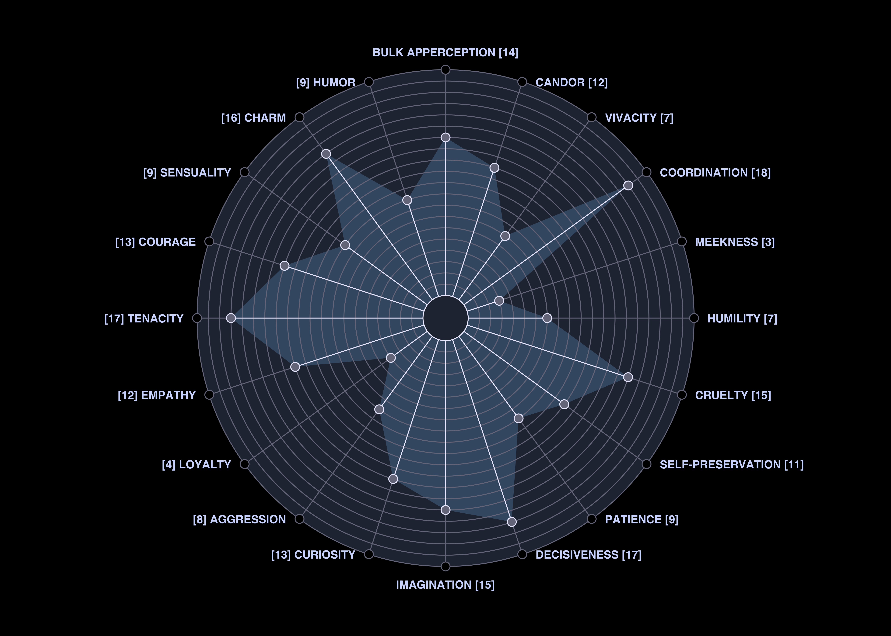

# Westworld Personality Matrix

This repo contains a tool for generating a personality matrix
in the style of [Westworld](https://www.hbo.com/westworld). 

# Personality Data

To generate a personality matrix, you'll need to create a CSV file containing
the desired personality attributes and values. Each line in the file contains an attribute
and a value between 1 and 20, separated by a comma. Comment lines can be created
by starting the line with #. Host will use the 
attributes in order, up to the first 20. 

See [this example attribute file](example.csv).

This example contains a list of known attributes from the show. You can pick
and choose from among those attributes or make up your own. Attributes
will be displayed in all caps. 

# Generating the Matrix

To create a matrix from your personality data, send the CSV filename to Host. The `host.sh` script
provides a simple interface. Just run `host.sh example.csv`. In that example, your matrix will be created
as `example.png`.
 